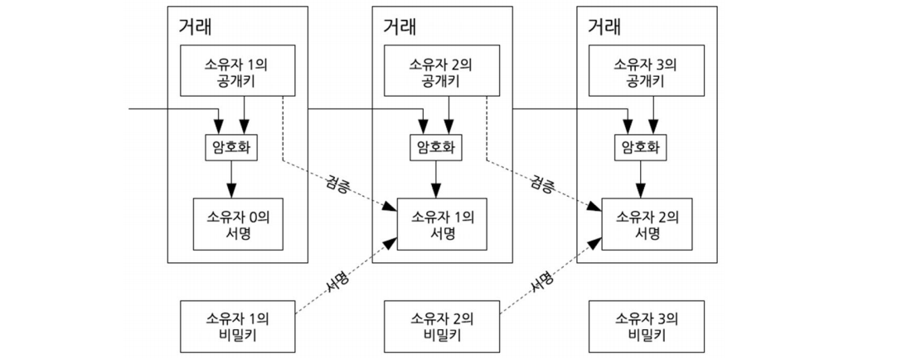
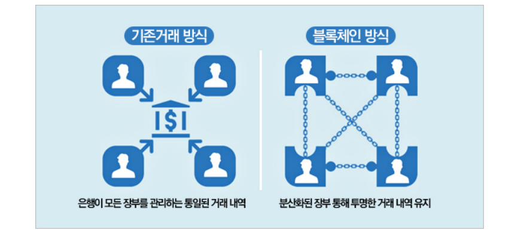
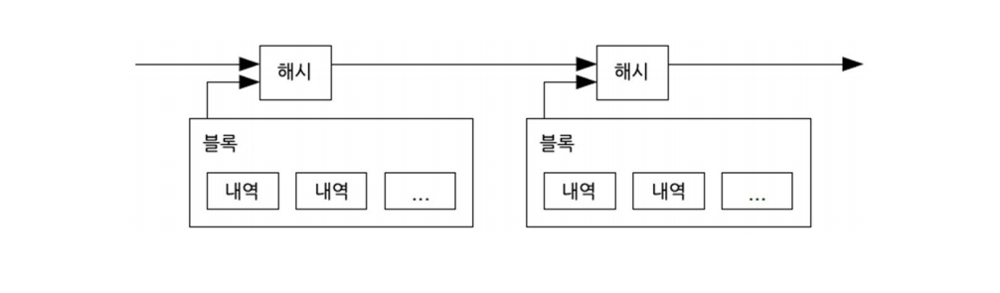
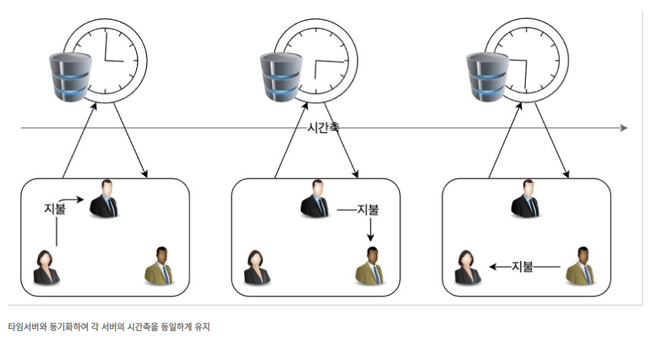
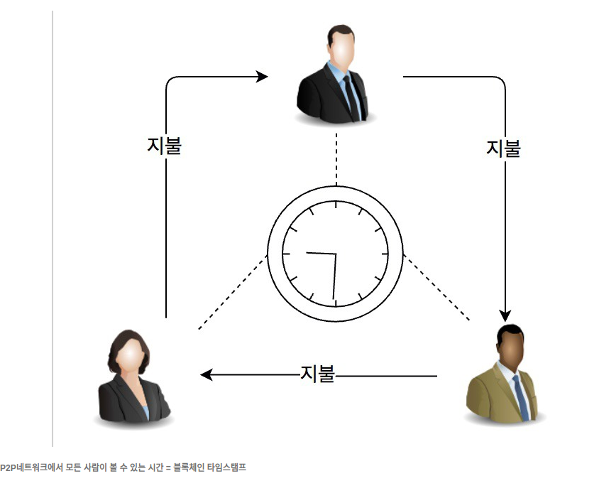
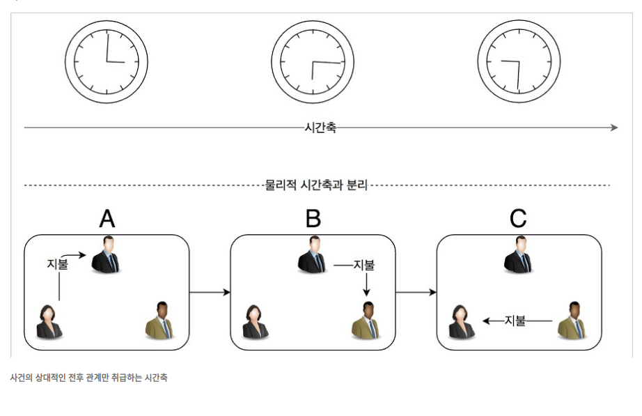
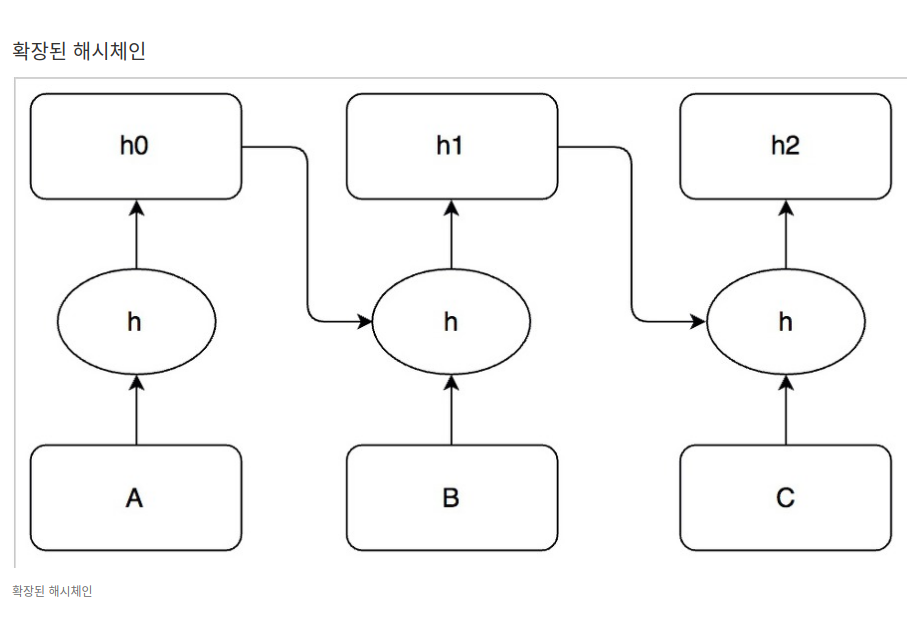

# 비트클라우드 백서

비트코인 백서 요약 정리
* 한글판(PDF): http://s.kwma.kr/pdf/BitCloud/bitcloudwpkor_p43.pdf
* 영문판(PDF): https://bitcoin.org/bitcoin.pdf

---
## 비트코인: 개인간 전자화폐 시스템 (사토시 나카모토)

## 0. 초록

* 순 개인과 개인간의 전자화폐는 한 집단에서 다른 곳으로 금융기관을 거치지 않고 직접 온라인 지불을 가능하게 할 것
* <b>디지털 서명 기술이 일부 해결해주지만, 믿을 수 있는 제 3자가 이중지불을 방지해야 한다면 그 주요한 장점은 사라짐
* </b> 이 논문에서는 <b>P2P 네트워크를 이용한 이중지불 문제의 해결 방법</b>을 제안
* <b>암호화 기반 작업증명 과정</b>의 연쇄 상에서 네트워크 시간 및 거래를 암호화하여 기록을 생성하게 되면 작업증명 과정을 되풀이하지 않는 한 바꿀 수 없게 됨
* <b>가장 긴 체인은 각 사건 순서를 입증</b>해주기도 하며, 가장 많은 컴퓨팅 파워가 입증했다는 뜻
* 노드들에 의해 제어되는 컴퓨터 전력의 <b>과반수가 협력하여 네트워크를 공격하지 않는 한, 그들은 가장 긴 체인을 생성하며 네트워크 공격자를 능가하게 될 것</b>
* 이러한 네트워크는 <b>최소한의 구조를 필요</b>로 함
* 각 노드들은 자발적으로 그 네트워크를 떠나거나 다시 합류할 수 있고, 어떤 일이 벌어졌는지에 대한 입증으로 가장 긴 작업증명 체인을 받아들이는 노드들의 메시지가 최대한 공유

#### 디지털 서명 기술

1. 네트워크 송신자의 신원을 증명하는 방법
2. 송신자가 자신의 비밀키로 암호화한 메시지(Digital signature)를 수신자에게 보냄 
3. 수신자는 송신자의 공용 키로 이를 해독하여, 송신자의 신원 파악

#### 이중지불

1. 동일한 화폐를 중복하여 두 번이상 지출하는 것을 의미
2. 현실에서는 은행과 같은 제 3자가 이와 같은 이중 지불을 방지

#### 작업증명(Proof-of-Work, PoW)

* 목표값 이하의 해시를 찾는 과정을 무수히 반복함으로써 해당 <b>작업에 참여했음을 증명</b>하는 방식
* 작업증명 시스템: 서비스 요청자로부터 <b>일부 작업을 요구함</b>으로써(일반적으로 컴퓨터에 의한 처리시간을 의미) 서비스 거부(DoS) 공격과 기타 서비스 악용(예: 네트워크 상의 스팸)을 단념하게 만들기 위한 경제적인 수단

---
## 1. 서론

* 인터넷에서의 상거래는 거의 금융기관을 <b>제 3자 신용기관</b>으로 하는 전자지불 방식에 전적으로 의존하게 됨
* 대부분의 거래에 시스템은 충분히 작동하고 있지만, 여전히 <b>신용기반 모델이라는 내재적인 약점</b>을 가짐
* 비용과 지불의 불확실성은 사람이 직접 물리적으로 화폐를 지불하여 피할 수 있으나, <b>신용기관 없이 통신상으로 지불하는 방법은 존재하지 않음</b>
* 이러한 문제는 신용보다 암호화 기술에 기반한 전자지불 시스템을 이용하여 자발적인 두 거래자가 제 3자인 신용기관 없이도 직접적인 거래를 가능하게 만듦
* <b>전산적으로 번복이 불가능한</b> 송금은 판매자를 <b>가짜 지불로부터 보호</b>(이중지불 방지)할 수 있으며, 구매자는 일반 <b>에스크로 방식</b>을 통해 보호받음
* 이 논문에서는,
  1. 거래들의 시간 순서를 전산적으로 입증하게 만들도록 하는 <b>P2P 분산 네트워크 기반 타임스탬프 서버</b>를 이용하여 이중지불 문제를 방지하는 해법을 제안
  2. 악의적으로 협력하는 <b>노드</b> 그룹보다 정직한 노드들이 더 많은 컴퓨팅 파워를 총체적으로 제어하는 한 안전함

#### 신용기반 모델 약점
* 완전히 취소 가능한 거래는 사실상 불가능한데, <b>금융기관은 거래 상의 분쟁을 중재해야 하는 일</b>을 피할 수 없음
* 이러한 중재 비용은 <b>거래 수수료</b>를 올려 실질적인 최소 거래금액을 설정하여 <b>소액거래의 가능성을 제한</b>하고, 회수 불가능한 서비스는 <b>번복 불가능한 지불을 하게 만들어 더 많은 비용을 발생</b>
* 즉, <b>지불 번복을 위해 더 많은 신용을 요구</b>하여 번복하지 못하게 만듦
* 상업자들은 불필요한 더 많은 정보를 요구하여 고객을 귀찮게 만들고 경계

#### 에스크로 방식
* 상거래 시에, 판매자와 구매자의 사이에 신뢰할 수 있는 중립적인 제 3자가 중개하여 금전 또는 물품을 거래를 하도록 하는 것, 또는 그러한 서비스 방식
* 구체적으로는 판매자·구매자·제 3자의 사이에서 다음과 같은 절차로 진행
1. 구매자는 제삼자에게 대금을 맡긴다.
2. 판매자는 제삼자에게의 입금을 확인하고 구매자에게 상품을 발송한다.
3. 구매자는 송부된 상품을 확인하고 제삼자에게 상품이 도착했음을 알린다. 당초의 거래 내용과 다른 경우는, 상품을 반송하거나 거래를 파기할 수 있다.
4. 제삼자는 판매자에게 대금을 송금한다.
5. 판매자는 대금을 수령한다(거래의 종료).
* (m.t.) 에스크로 방식을 도입하는 것으로 보아, 제 3자의 존재를 남기는 것은 불가피 함으로 보임.

#### 타임스탬프
* 특정한 시각을 나타내는 문자열로서, 둘 이상의 시각을 비교하거나 기간을 계산할 때 편리하게 사용하기 위해 고안되었으며, 일관성 있는 형식으로 표현
* 파일시스템에서 타임스탬프는 저장된 파일이 생성되거나 변경된 시각을 뜻하기도 함

#### 비트코인 노드
* 비트코인 네트워크에 연결된 모든 컴퓨터를 노드라고 정의
* 노드들은 지갑, 블록체인 복사본, 검증엔진, 채굴, P2P 네트워크 전송 등의 기능을 갖고 있음
* 종류
1. Full Node: 비트코인 거래 정보(블록체인) 전부를 저장하고 비트코인 사용자들의 지갑을 관리하며 비트코인 네트워크상으로 직접 거래를 만들어 낼 수 있음
2. Lightweight Client: 사용자의 지갑을 저장하긴 하지만 비트코인 거래나 네트워크에 접근하기 위해서는 제 3자가 소유한 서버에 의존하며, 일반적으로 블록체인의 헤더정보만 저장
3 Web Client: 웹 브라우저를 통해 접속하며 제 3자가 소유한 서버상에서 사용자의 지갑을 저장(ex. 거래소)
4 모바일 비트코인: 스마트폰에서도 Full node, Lightweight/Web Client 사용 가능
   
* Full Node에 대해 조금 더 살펴보면,
1. 지갑, 블록체인 복사본, 검증엔진, 채굴, P2P 네트워크 전송등의 기능을 갖고 있는 노드
2. Full Node는 블록에 포함된 트랜잭션들과 블록 전체의 정합성(무모순성)을 검증
3. 검증을 통과한 블럭만 정당한 블록으로 인정하고, 로컬 데이터베이스를 업데이트하고 다른 노드로 전파
4. 블록체인 동기화 과정에 긴 시간과 많은 용량이 필요

---
## 2. 거래
* 이 논문에서는 <b>전자 화폐를 디지털 서명의 연속으로 정의</b>
* 각 암호키 소유자들은 그 전까지의 거래 내역에 다음 소유자의 공개키를 덧붙인 뒤에 자신의 비밀키로 암호화하는 디지털 서명을 하고 넘김
* 돈을 받은 사람은 서명 소유자들의 체인과 서명들을 검증할 수 있음

* 돈을 받는 사람은 소유자들 중 한 명이 이중지불을 하지 않았는지 검증할 수가 없는 상황에서 문제가 발생 가능
* 공통적인 해법은 각 거래가 이중지불이 되었는지 신용해주는 중앙기관을 도입하는 것
* 각 거래 후에, 그 화폐는 다시 새로운 화폐로 찍어내기 위해 중앙기관으로 회수되어야 하고, 이중지불이 아닌 것을 믿을 수 있도록 중앙기관에서만 직접 화폐를 발행하여 쓰도록 함
* 이러한 방법의 문제는 화폐 시스템 전체가 바로 은행 같은 중앙기관에 모든 거래 내역이 거쳐가도록 하는 방법에 의존하도록 된다는 것
* 결국, 돈을 받는 사람이 이전 소유자가 그 전에도 어떤 거래에도 서명을 하지 않았는지를 확인할 방법이 필요 (m.t. 즉, 이중지불 확인할 방법 필요)

블록체인에서는,
* 가장 먼저 일어난 거래 내역을 찾기만 해도 그 이후에 이중지불을 시도했는지 확인할 필요가 없음
* <b>거래 내역이 하나라도 비어있는지 확인하는 유일한 방법은 모든 거래 내역을 살펴 보는 것</b>
* 바로 찍어낸 화폐를 기반으로 한 모델에서는 모든 거래를 확인하고 어느 것이 먼저 이뤄졌는지를 결정하면 됨
* 신용기관을 통하지 않고도 이런 방법을 가능하게 하기 위해서는, <b>모든 거래가 공개적</b>으로 알려져야 하고[1], <b>참여자들이 시간 순서에 따라 단일 거래내역으로 수용하는 시스템이 필요</b>
* 돈을 받는 사람은 매 거래 시마다, 과반수 이상의 노드들이 최초의 거래라고 인정해주는 <b>시간 증명이 필요</b>
* 과반수 이상이 합당한 결제로 판단하면 처리 진행

---
## 3. 타임스탬프 서버
* 시간 내역이 기록된 항목들의 블록 해시를 취합하고, 신문이나 유즈넷 포스트처럼 그 해시를 널리 발행하는 역할[2~5]
* 타임스탬프 내역은 해시에 포함될 수 있도록 그 시간에 데이터가 명백히 존재했다는 것을 입증
* 각 타임스탬프 내역은 이전 타임스탬프로부터 받은 해시 내역을 포함시킴으로써 보강하는 체인을 형성

#### 중앙집권적 타임스탬프

인터넷 서비스는 불특정 다수의 사람들에게 서비스하는데 있어서 어느 한 곳에 중심을 두고 그 중심정의 시간을 기준으로 서비스 무결성을 유지하고 있다. 보통, <b>하나의 타임서버에 접근하여 시간 동기화를 하는 방식으로 모든 서버가 동일한 시간축</b>을 갖도록 사용하고 있다. 이 경우 타임서버가 해킹당한다면 시간축이 틀어질 수 있는 단점이 존재한다. 이 논문에서는 중앙집권적 구조가 아닌 P2P 형태의 구조를 생각한다.

#### 비중앙집권적 타임스탬프

P2P 시스템에서 중심부 시간에 의존하지 않은 상태로 타임스탬프를 필요로 하는 데이터를 처리하기 위해 새로운 타임스탬프 방법이 필요해졌다. 다시 말해, 타임스탬프가 필요한 서비스를 P2P로 실현하기 위해 중심부 시간에 동기하는 방법으로는 한계가 존재하여 블록체인 타임스탬프 개념이 나왔다. 블록체인이 획기적으로 보이는 이유는 시간을 되돌릴 수 없다는 것과 1개의 시간축을 모두가 공유하고, 그 시간축에서 전화 관계를 정의할 수 있는 물리적인 시간 특징을 암호학에 기초한 데이터 구조를 사용하여 다시 구현한 것이다.

#### 해시체인 타임스탬프

물리적 시간의 동기화가 확인하기 어려운 분산시스템에서 모든 참가자가 하나의 시간축을 공유하려면 어떤 시간이 일어난 절대적인 시간을 엄격하게 요구하는 것이 아니라, 전후 관계가 존재하는 2개의 사건에 대해 그 순서를 특정할 수 있는 상대적 시간으로 시간축을 정의하는 방법이 있다. 즉, 사건 1과 사건 2가 발생했을 때, 사건1과 사건 2가 일어난 정확한 시간은 몰라도 '사건 1이 사건 2 다음에 발생했다'라는 상대적인 전후 관계만을 취급한다는 것이다. 이 개념은 <b>분산시스템의 논리적 타임스탬프</b>라고 말한다.

블록체인은 암호화 해시함수를 사용하여 데이터가 존재하기 전에 다른 데이터가 존재했다는 전후 관계를 논리적으로 부정할 수 없는 형태로 정의하고 있다.

위 그림에서 A데이터에 대해 암호화 해시함수를 이용하여 얻어진 해시값을 h(A)라고 하자. h(A) 값이 존재하는 것은 이전 A데이터가 있는 것이 논리적으로 옳다고 본다. 또한, B = h(A)로 h(B)를 계산하면 h(B)가 존재하기 전에 h(A)가 존재하고 있었다고 볼 수 있다. 이처럼 동일한 데이터에 대해 재귀적으로 암호화 해시함수를 적용하는 기술이 해시체인이다. 이 해시체인은 일회성 비밀번호 인증 시스템 구현에서 주로 사용된다.

#### 확장된 해시체인

블록체인은 위의 확장된 해시체인을 사용하여 모든 데이터의 존재증명과 전후 관계를 증명할 수 있다. 실무적인 P2P 시스템에서 사용하기 위해서는 몇가지 이슈를 해결해야 한다.
1. 여러 개의 노드가 참여하는 P2P 네트워크에서 모든 노드가 항상 최신 타임스탬프를 볼 수 있는가?
2. 노드가 과거 데이터를 변조한 경우, 변주 탐지 및 변조 데이터를 거부할 수 있는가?
블록체인에서는 첫 번째 이슈를 해결하기 위해 모든 데이터를 항상 모든 노드에서 공유하지 않고 여러 데이터를 정리한 블록단위로 공유한다. 이 블록을 만드는데 사용되는 기술이 <b><a href="http://brownbears.tistory.com/372">머클트리(Merkle tree 또는 Hash tree)</a></b>이다. 또한, 이 머클트리를 사용하여 두 번째 이슈를 해결할 수 있다.

---
## 4. 작업증명
* P2P를 기반으로 하는 <b>분산 네트워크 타임스탬프 서버를 구현하기 위해서는</b> 신문이나 유즈넷 포스트 대신 <b>Adam Back's Hashcash[6]와 비슷한 작업증명 시스템을 이용할 필요</b>가 있음
* <b>작업증명에는 SHA-256과 같은 알고리즘으로 다수의 0비트들로 시작되는 암호화 해시값을 찾는 과정이 포함</b>
* 평균적으로 이러한 작업에 드는 시간은 연속되는 0비트의 요구 개수에 따라 지수적으로 증가하며, 암호화 해시를 한번 수행하는 것으로 확인할 수 있음

* <b>타임스탬프 네트워크에서는 작업증명의 방법으로 블록 해시 결과가 0비트들을 갖도록 하는 해시값을 찾을 때까지 블록에 임시값(nonce)을 증가시켜가는 과정</b>을 구현
* CPU가 노력한 결과가 <b>한번 작업증명 조건에 도달하게 되면, 그 블록은 다시 과정을 번복하지 않는 한 고정</b>됨
* <b>그 다음 블록들이 체인을 형성함으로써, 하나의 블록을 변경하기 위해서는 그 블록을 포함한 다음 모든 블록들에 대해 작업 증명과정을 다시 수행</b>해야 됨

* 작업증명은 또한 <b>다수결에 의한 의사결정 과정에서 대표자를 결정하는 문제를 해결</b>
* 다수가 한 IP주소당 한번의 투표를 할 수 있는 시스템 기반으로 결정된다면, IP주소를 많이 확보하는 방법으로 누구나 시스템을 뒤엎어버릴 수 있음
* <b>작업증명은 본질적으로 한 개의 CPU당 한 번의 투표를 하는 구조</b>
* <b>다수의 결정은 가장 긴 체인을 나타내며, 이는 가장 많은 작업증명에 노력이 투입된 것</b>이 됨
* 컴퓨팅 파워의 과반수가 정직한 노드들에 의해 제어되고 있다면, 정직한 체인이 가장 빠르게 늘어나, 경쟁 체인을 압도하게 될 것
* 실제로는 Emin Gun Sirer, Ittay Eyal에 의해 <b>전체 컴퓨팅 파워의 과반수 50% 이상이 아니라 25% 이상만 점유해도 된다</b>고 밝혀져 있고, 현재 전체 순위 1~2위 마이닝 풀 집단은 25% 이상에 달함
* 과거의 블록을 수정하기 위한 <b>공격자는 수정할 블록과 그 이후에 이어진 모든 블록에 대해 작업증명 과정을 번복한 다음 이어서 다른 정직한 노드들이 이루고 있는 체인보다 더 빠른 속도로 따라잡아 추월해야 함</b>
* 느린 <b>공격자의 추격 가능성은 블록들이 이어서 추가될 수록 지수적으로 감소</b>하는 것에 대해 뒤에서 언급하기로 함

* 시간이 흐름에 따라 HW 속도 증가와 노드들의 참여도 증가율을 보상하기 위해서, <b>작업증명의 난이도는 시간당 평균 블록 생성 수를 기준으로 하는 이동평균 타깃으로 결정</b>
* 블록이 너무 빠르게 생성되면 난이도는 급증함

#### 역주
* (m.t.) 현재 비트코인의 PoW에 문제가 없다는 것은 아니지만, 비트코인은 가치가 많이 올랐기 때문에, 참여자들이 자신들이 가진 비트코인의 가치를 떨어뜨리기 원하지 않는 한, 과반수 이상이 현 합의를 유지할 것임
* (m.t.) <b>동시에 둘 이상의 block이 생성될 수도 있다.</b> 물리적으로 거리가 먼 노드들이 거의 동시에 nonce 값을 찾아, 모두가 동일하게 갖고 있던 chain의 마지막 블록에 각각 새로운 블록을 추가하며 인접 노드들에게 전파하면, 앞서 말한 것처럼 둘 이상의 block으로 서로 다른 chain이 생성될 수 있다. 이러한 상황을 <b>블록체인 분기</b>라고 부르며, <b>추후 가장 긴 chain만이 가장 많은 작업증명에 노력이 투입된 것으로 인정 받아 살아남는다.</b>

* Promblems with Proof of Work
1. Wasted energy
2. Vulnerable to ASICs and centralization
3. Lacks 'finality'
4. No clearly defined validator set

* 이와 같은 PoW의 문제점을 극복하기 위한 하나의 알고리즘으로 <b>PoS(Proof of Stake)</b>가 존재하며, 추후 이더리움 정리할 때 다시 살펴보고, 현재는 간단하게 몇 가지 특징만 알아보자.
1. <b>PoS에서는</b> 채굴자(Miner) 대신 <b>검증인(Validator) 용어를 사용</b>
2. 검증인이란, <b>블록을 생성하기 위해 참가하는 사람</b>을 의미
3. 해시파워가 많이 필요하지 않아 <b>경제적</b>
4. PoW와 다르게 채굴기와 같은 <b>고성능 HW가 필요하지 않음</b>
5. 참여한 노드들이 <b>이자</b>를 받으려고 <b>코인을 묶어 두려</b>하기 때문에, 시중 <b>코인의 유통량 감소</b>로 이어질 수 있음
6. <b>코인을 많이 보유한 사람이 너무 강한 권력</b>을 갖게 됨
7. <b>네트워크의 모든 노드들이 검증</b>을 하기 때문에 속도면에서 뒤쳐질 수 있음
8. 2세대 PoS로서 <b><a href="https://ehtersear.ch/t/latest-casper-basics-tear-it-apatr/151">Ethereum's Casper</a></b>가 존재
* <a href="https://www.youtube.com/watch?v=XXPY6pMDVYE&list=PL9exlAiBT5QkxPzOO1d83FBW4Wjtfqwt&index=2">Incentives in Ethereums Hybrid Casper Protocol</a>
9. <b>Ethereum's Casper에서는 검증인이 되기 위해, 일정량 이상의 이더리움을 예치(deposit)해야 함</b>

#### Adam Back's Hashcash
* Adam Back: 영국의 암호학자이며, 1997년 11월 스팸메일과 서비스 거부(DoS) 공격을 제한하기 위해 Hashcash라는 작업증명 시스템을 개발
* Hashcash 작업증명 시스템은 이후 비트코인 등 여러 암호화폐에서 채택되어, 채굴 알고리즘으로 사용되고 있음
* 이메일을 보낼 때, 우표 대신 해시캐시를 지불하게 함으로써 시간과 비용 부담 때문에 대량 스팸메일 발송을 못하게 하려는 목적이었음
* 즉, 이메일을 발송하기 위해서는 해시캐시 스탬프를 미리 받아야 하는데, 이 스탬프를 받으려면 컴퓨터 연산을 통해 일정한 Hash를 찾도록 하는 작업증명(PoW) 과정을 거치도록 했음
* <b>작업증명을 통해 특정 해시값을 찾기 위해 수많은 반복 연산을 수행하도록 함</b>으로써, 상당한 시간과 비용이 들게 해서 결국 대량 스팸메일을 보낼 수 없도록 하겠다는 생각이었음
* Hashcash는 컴퓨팅을 위해 작업량을 선택할 수 있는 작업증명 알고리즘이지만, 증명은 효율적으로 검증될 수 있음
* 이메일을 사용하는 경우, <b>Hashcash 스탬프의 텍스트 인코딩은</b> 이메일의 헤더에 추가되어 보낸 사람의 이메일을 보내기 전에 스탬프를 계산하는 CPU <b>시간을 적당히 소비했음을 증명</b>
* 즉, 보낸 사람이 스탬프를 생성하고 이메일을 보내는 데 일정 기간이 걸렸으므로 스팸일 가능성은 거의 없다고 판단
* 수신자는 적은 계산 비용으로 스탬프가 유효한지 확인할 수 있음
* 그러나, <b>헤더를 찾는 유일한 방법은 무차별하게 해답이 발견될 때까지 무작위 값을 시도하는 것</b>
* 개별 문자열을 테스트하는 것은 쉽지만, 만족스러운 답변이 거의 없는 경우 대답을 찾기 위해 많은 노력이 필요

* 장점
1. 합법적인 이메일에 실제 돈이 포함되지 않은 소액 결제 제안을 적용하는 것 보다 유리
2. 발송인이나 수령인이 지불할 필요가 없으며, 소액 결제와 관련된 행정 문제와 이메일 요금 청구와 관련된 도덕덕 문제를 회피 할 수 있음
3. 메일 사용자 에이전트 및 스팸 필터에 구현하기 매우 쉬움
4. 중앙 서버가 필요 없음
5. 점진적으로 배포 될 수 있음

* 단점
1. 전송되는 각 전자 메일에서 잠재적으로 중요한 계산 리소스를 소비해야하므로 클라이언트가 유효한 헤더를 계산하는 데 소비하는 평균 시간의 이상적인 양을 조절하는 것은 다소 어려움
2. 이는 시스템의 접근성을 저하시키거나, 스팸으로부터 효과적인 필터를 제공할 정도로 충분하지 않아 위험을 감수해야 한다는 것을 의미
3. 스팸이 아닌 전자 메일은 보낸 사람의 처리 능력 부족으로 인해 막히거나, 스팸 이메일이 통과될 가능성이 높음
4. 무어의 법칙에 따라 컴퓨터의 성능이 향상되며, 필요한 계산의 어려움은 시간이 지남에 따라 증가
5. 그러나, 개발도상국에서는 오래된 HW를 사용할 것으로 예상될 수 있음
6. 즉, 이메일 시스템에 참여하는 것이 점점 어려워 질 것
7. 이는 최신 HW를 구입할 여유가 없는 선진국의 저소득층 개인에게도 적용될 수 있음

* 기술적 측면에서,
* 송신자 측
1. 헤더를 준비하고 카운터 값을 초기화 된 임의의 숫자에 추가
2. 이어서, 헤더의 160비트 SHA-1 해시를 계산
3. 해시의 처음 20비트가 모두 0인 경우, 이는 허용 가능한 헤더
4. 그렇지 않은 경우, 발신인은 카운터를 증가시키고 해시를 다시 시도
5. 2,160개의 가능한 해시 값 중에서 이 기준을 충족시키는 2,140개의 해시 값이 존재
6. 따라서, 처음 20개가 0이어야 하는 헤더를 무작위로 선택하는 확률은 220분의 1
7. 송신자가 유효한 해시 값을 얻으려고 시도하는 횟수는 기하 분포에 의해 모델링됨
8. 따라서, 송신자는 평균적으로 유효한 헤더를 찾기 위해 220개의 값을 시도해야 함
9. 해시를 계산하는 데 필요한 시간의 합리적인 추정치를 고려할 때 찾는 데 약 1초가 소요됨

* 수신자 측
1. 수신자의 컴퓨터는 전체 문자열의 160비트 SHA-1 해시를 계산
2. 이 작업은 약 2 마이크로초가 소요되며, 나머지 이메일을 받는데 걸리는 시간보다 훨씬 짧은 시간
3. 처음 20비트가 모두 0이 아니면 해시가 유효하지 않음
4. 수신인의 컴퓨터는 헤더의 날짜를 확인
5. 현재 날짜로부터 이틀 이내 없으면 유효하지 않음
6. 수신인의 컴퓨터는 해시 문자열의 이메일 주소가 수신인이 등록한 유효한 이메일 주소와 일치하는지 또는 수신인이 가입한 메일 목록과 일치하는지 확인
7. 일치 항목을 찾을 수 없으면 해시 문자열이 잘못된 것
8. 수신인의 컴퓨터는 해시 문자열을 데이터베이스에 삽입
9. 해시 문자열이 이미 데이터베이스에 있는 경우, 이는 유효하지 않음
10. 해시 문자열이 이러한 테스트를 모두 통과하면 유효한 해시 문자열로 간주

* 적용
* 비트코인 채굴
1. 비트코인 채굴자는 네트워크에서 코인 거래자로부터 검증되지 않은 거래를 수집하는 컴퓨터 프로그램을 실행
2. 다른 데이터를 사용하면 이것들은 블록을 형성하고 채굴자에게 지불할 수 있지만, 채굴자가 시행 착오를 통해 '논스(nonce)' 번호를 발견한 경우에만 블록이 네트워크에 의해 받아들여짐
3. 이 논스는 네트워크의 난이도 목표를 달성하기 위해 충분한 수의 제로 비트를 가진 해시를 산출
4. 첫 번째 코인이 형성된 이래로 채굴자로부터 받아 들여지는 블록은 비트코인 블록체인을 형성
5. 해시캐시는 SHA-1해시를 사용하고 160개의 해시 비트 중 처음 20개가 0이어야 하는 반면, 비트코인의 작업 증명은 SHA-256 해시를 사용하며 원래 256비트 중 처음 32개가 0이어야 함
6. 그러나, 비트코인 네트워크는 시간 당 6개의 블록 평균 생성 속도를 유지하기 위해 난이도를 주기적으로 재설정함
